# Instalación y configuración de FTP

# 1. Introducción.
En esta guía vamos a ver como instalar y configura en protocolo FTP. Este protocolo es de los mas usados para la transferencia de archivos y carpetas. 

# 2. Instalar FTP
Primero vamos a instalar el servidor FTP vsFTPd en este caso en un Ubuntu 20.04. Vamos a usar el comando apt para instalarlo desde los repositorios oficiales de ubuntu, pero antes de so vamos a actualizar los paquete de los repositorios.
`sudo apt update` 

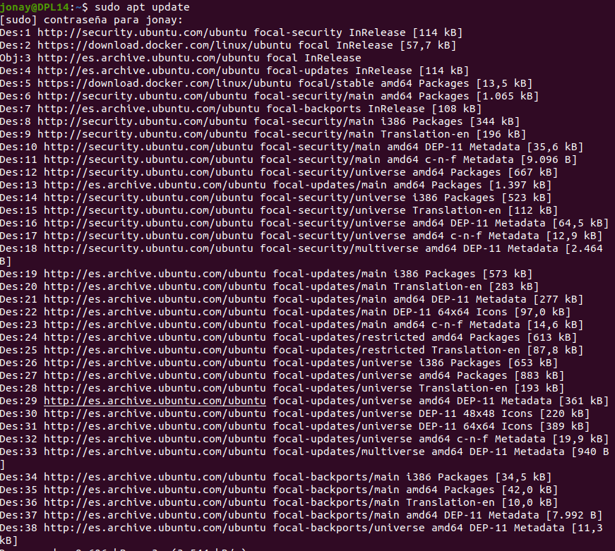

Con esto realizado ahora si vamos a proceder con la instalación, para ello.
`sudo apt install -y vsftpd`

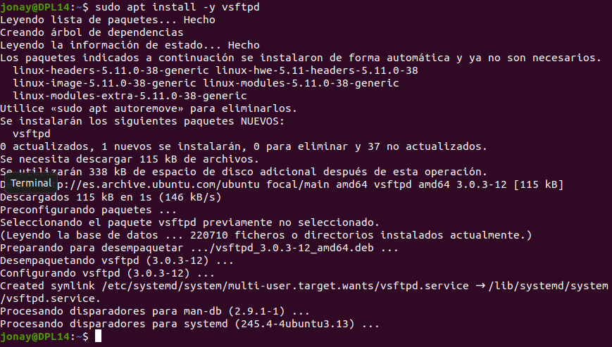

Con el “demonio” instalado vamos a añadir las reglas del fireall para los puertos del protocolo.
`sudo ufw allow ftp`

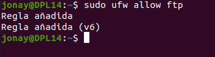

`sudo ufw allow ftp-data`

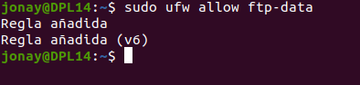

# 3. Configuración el servidor FTP.
Por defecto ftp usa el modo activo, este modo solo da acceso a cliente que no se encuentran tras un firewall. Y luego el modo pasivo que nos da mas utilidades para muchos escenarios. En esta guiá veremos como configurar el servidor para el acceso de usuario a través de firewall.

Primero vamos a activar el modo pasivo de ftp, para ello vamos al fichero de configuración de vsftp que se encuentra en “/etc”. En este fichero vamos a añadir las siguientes lineas para activar el modo pasivos y añadir un rango de puertos para el acceso.

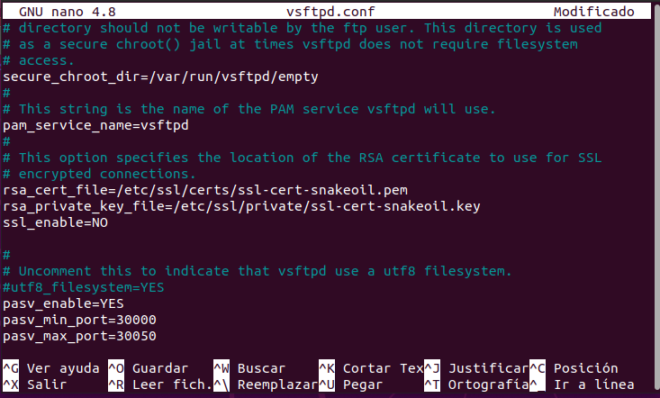

Al terminar de configurar reiniciamos el servicio.

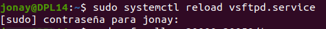

También tenemos que permitir el acceso a través del Firewall del rango de ip.

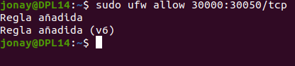

Vamos a comprobar que podemos acceder por medio del cliente. Para este paso necesitamos tener un maquina cliente que va a solicitar los fichero del servidor, en este caso se ha usado una maquina Window con un Filezilla cliente. Filezilla es una interfaz grafica para conectar y trabajar con el protocolo FTP.
**Es muy importante tener un regla de entrada en el firewall del cliente para que funcione. **
Aun así también podemos conectar por FTP a través de un terminal ya sea en Window como en Ubuntu. Nos pedirá un nombre y usuario del sistema servidor.

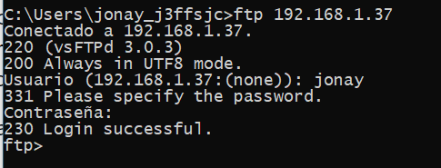

Y ahora también vamos a acceder usando el cliente filezilla. Para esto abrimos el filezilla y pinchamos el botón desplegable de la izquierda y en el añadimos un nuevo sitio con la configuración del servidor. Al terminar le damos a ok o a connect, que nos pedirá la contraseña y seguido nos debería conectar.

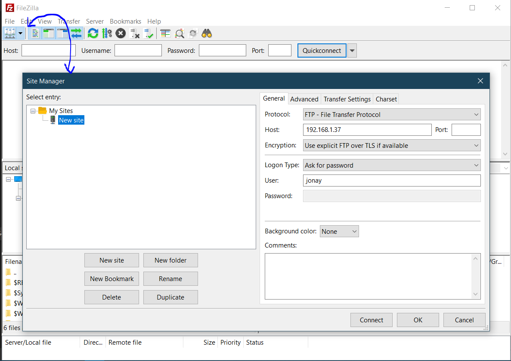

Conectamos con ftp. Como vemos podemos ver nuestras archivos en la izquierda y los del servidor en derecha.

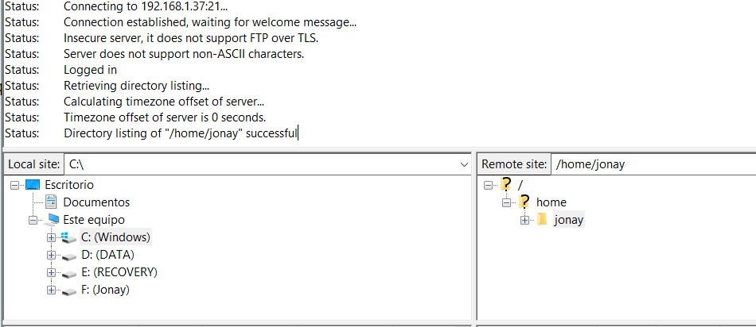

Ahora vamos a ver otras configuraciones que pueden ser interesantes.
“local_enable” podemos activar o desactivar el acceso de usuarios del sistema.

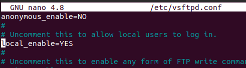

Podemos permitir que los usuario escriban en sus directorios con “write_enable”

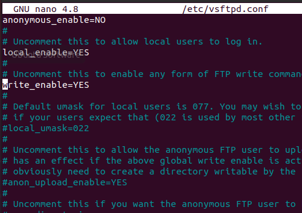

Luego tenemos “chroot_local_user” esta directiva permite lo que se conoce en ftp “enjaulado” de usuarios. Esto lo que hace que los usuarios locales solo pueden navegar por sus directorios personales. Esta característica no se puede activar si la raíz del directorio personal es escribirle.

Y luego tenemos “allow_writeable_chroot”, que añade permisos a los directorios del usuario para que se permita escribir en ellos.

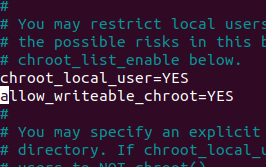

# 4. Seguridad TLS
Una de las cosa que nos falta es tener una conexión cifrada, para cifrar las conexiones se usa las claves RSA y un certificado.

Vamos a probar como crear y añadir un certificado para permitir las conexiones cifradas en ftp. 

Primero vamos a crear un certificado auto firmado. Lo mas importante es el common name donde ira el dominio (daw.dpl).

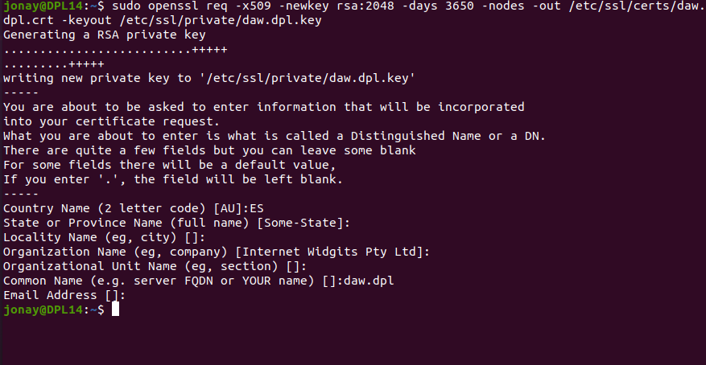

Ahora vamos a fichero de configuración de vsftpd y activamos el ssl y añadimos las rutas de nuestro certificado.

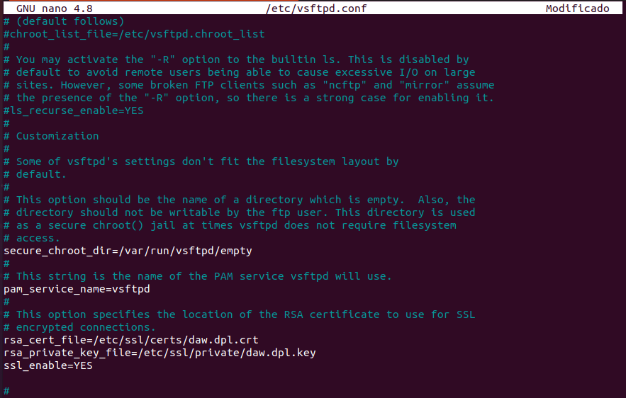

Con esto reiniciamos el servicio.

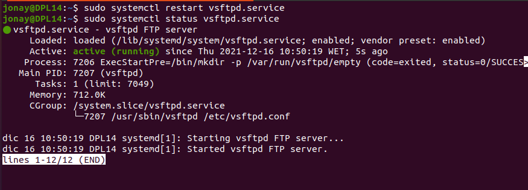

Ahora solo nos queda probar a acceder usando el cliente filezilla. Donde nos aparcera el certificado.

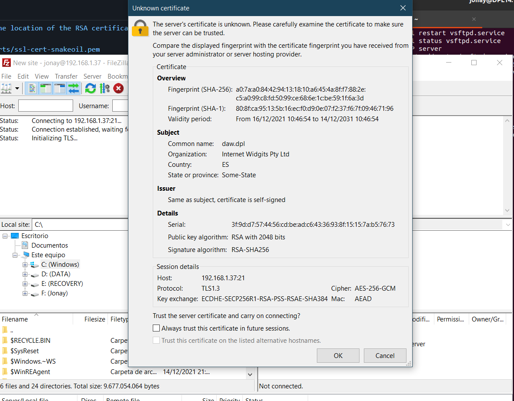
